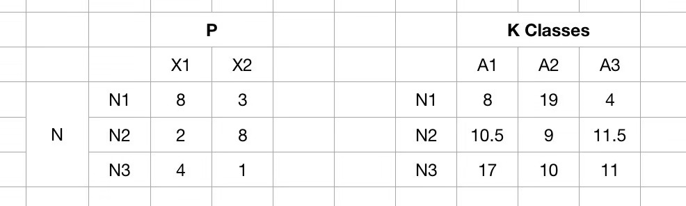
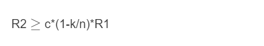
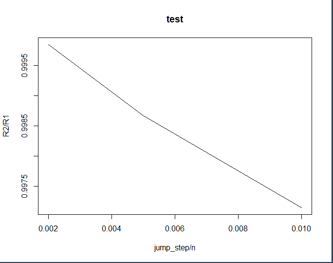

# 2019 斯坦福暑研 机器学习decision tree

## 整体架构

本项目为R语言与C++语言结合开发的项目，输入为一系列经过处理的数据（特征值）和每一步分支分类的reward，输出为最佳的分类，是一个会根据features分类的决策树任务。本项目实现了该决策树算法的greedy实现以及skip算法提高效率的思考，以及budget算法的初步构思。

Rcode文件夹中主要是调用Ccode文件夹中的代码以及进行大规模数据的运算与可视化等，Ccode文件夹中的C++代码文件及.h头文件实现了greedy算法和skip算法。

数据经过预处理，输入两个矩阵，一个是feature矩阵，另一个是rewards矩阵，众多样本由各个特征组成，rewards包含众多样本的各种分类的class。

这个项目的数据是经过预处理的，我们当时做的就是其中一环，相当于数据已经处理过成这两个矩阵（真实的数据需要经过处理为这两个矩阵）。决策树需要做的就是生成一个policy，决定分到哪个class的rewards比较高，这个分类方法是通过检测的哪个维度的features。

训练这个policy有几种方法。最基本的是ground choose最优解方法，全遍历一遍，找到所有的分类方法，然后找到rewards值最大的那个，记录下来作为policy。但这样复杂度太高，所以我们有接下来的greedy方法实现以及skip优化方法实现。

## greedy实现

首先对各种分类方式进行排序，在决策树的每一层都去找rewards最大的分类方式，相当于每一层遍历Nfeatures * (NSample-1)个分割点，找到rewards值最大的分割点，设置为分割点，记录policy，以此类推。

## skip优化实现（线性优化得出结果，待证明）

skip是对greedy的一个优化，就是在greedy方法找分割点的时候，设置步长>1，并且我们初步假设，按照这样skip的方法，和最优解的值应该有一个线性的关系。我们假设最终用skip方法求得的rewards为R2，ground choose（最优解）求得的rewards为R1，预想会满足这样一个不等式。

其中c是常数，n是总样本数，k是每一次的步长。

实际的实验结果证明确实是线性关系，但其中的理论关系仍未求证推导。

## budget_function
